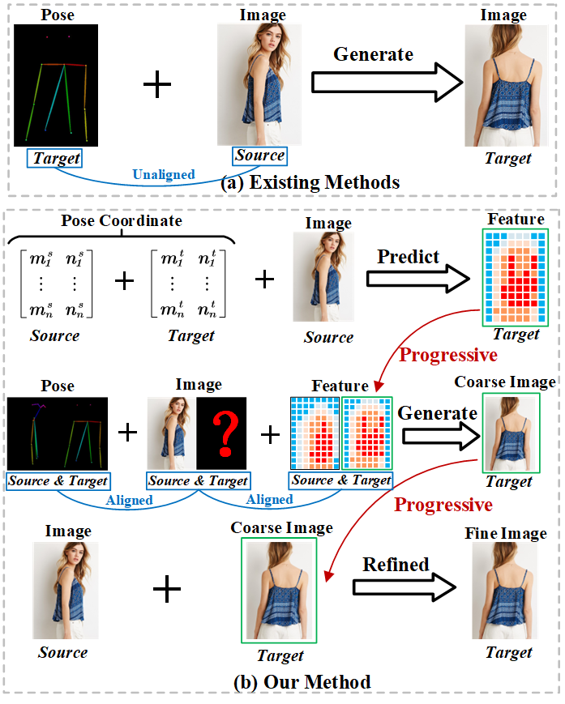
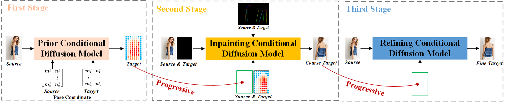

# PCDMs
 Implementation code：[Advancing Pose-Guided Image Synthesis with Progressive Conditional Diffusion Models](https://arxiv.org/pdf/2310.06313.pdf)


## Generated Results


You can directly download our test results from Google Drive: (1) [PCDMs vs SOTA](https://drive.google.com/drive/folders/1q21tA3VsQqScecQ7m3_eUFxIPWUGYKAa?usp=drive_link) (2) [PCDMs Results](https://drive.google.com/drive/folders/1sjqMhZ79pugk2IHhW-whg_NASpx3BSew?usp=drive_link).

The [PCDMs vs SOTA](https://drive.google.com/drive/folders/1q21tA3VsQqScecQ7m3_eUFxIPWUGYKAa?usp=drive_link) compares our method with several state-of-the-art methods e.g. ADGAN, PISE, GFLA, DPTN, CASD, NTED, PIDM. 
Each row contains target_pose, source_image, ground_truth, ADGAN, PISE, GFLA, DPTN, CASD, NTED, PIDM, and PCDMs (ours) respectively.


## Methods






## Dataset
### Processed Data
This [link](https://drive.google.com/drive/folders/17yqf2iV2y7Hwx-__uV_-cRaOm2XX8lWS?usp=drive_link) contains processed and prepared data that is ready for use.
The data has been processed in the following ways:

&#8226; Rename image

&#8226; Split the train/test set

&#8226; keypoints extracted with Openpose

The folder structure of dataset should be as follows:

```
Deepfashion/
├── all_data_png                        # including train and test images
│   ├── img1.png          
│   ├── ...
│   ├── img52712.png         
├── train_lst_256_png                   # including train images of 256 size
│   ├── img1.png
│   ├── ...
│   ├── img48674.png
├── train_lst_512_png                   # including train images of 512 size
│   ├── img1.png
│   ├── ...
│   ├── img48674.png
├── test_lst_256_png                    # including test images of 256 size
│   ├── img1.png
│   ├── ...
│   ├── img4038.png
├── test_lst_512_png                    # including test images of 512 size
│   ├── img1.png
│   ├── ...
│   ├── img4038.png
├── normalized_pose_txt.zip             # including pose coordinate of train and test set
│   ├── pose_coordinate1.txt
│   ├── ...
│   ├── pose_coordinate40160.txt
├── train_data.json                     
├── test_data.json
```

### Original Data
 Download ```img_highres.zip``` of the DeepFashion Dataset from [In-shop Clothes Retrieval Benchmark](https://drive.google.com/drive/folders/0B7EVK8r0v71pYkd5TzBiclMzR00?resourcekey=0-fsjVShvqXP2517KnwaZ0zw). 
 
 Unzip ```img_highres.zip```. You will need to ask for password from the dataset maintainers. 


## Checkpoints Links
We provide 3 stage checkpoints available [here](https://drive.google.com/drive/folders/1xDpSIBdP11UoXe0HoWGPWBfEnk1zRMVw?usp=drive_link).


## TO DO
Released the train and test code.


## Citation
If this work is useful to you, please consider citing our paper:
```
@article{shen2023advancing,
  title={Advancing Pose-Guided Image Synthesis with Progressive Conditional Diffusion Models},
  author={Shen, Fei and Ye, Hu and Zhang, Jun and Wang, Cong and Han, Xiao and Yang, Wei},
  journal={arXiv preprint arXiv:2310.06313},
  year={2023}
}

```

